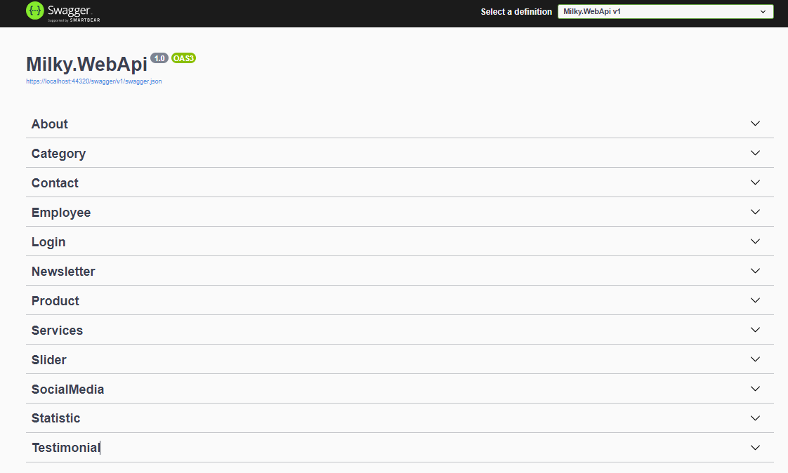
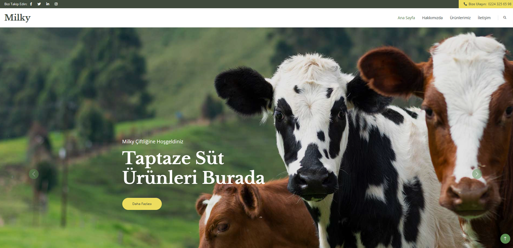
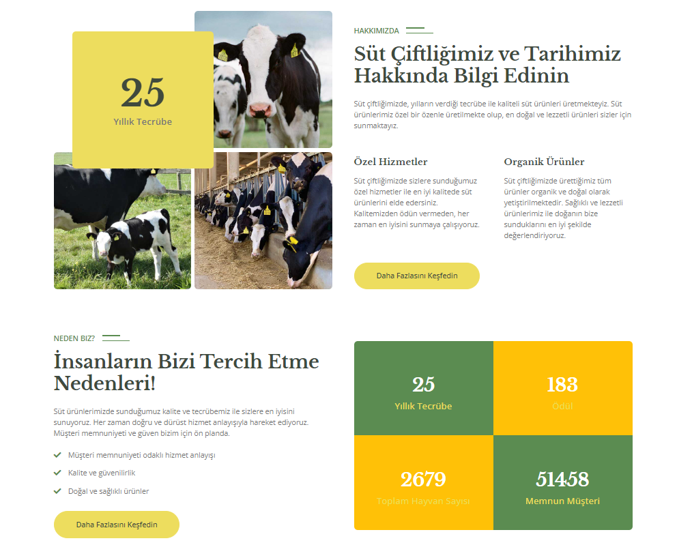
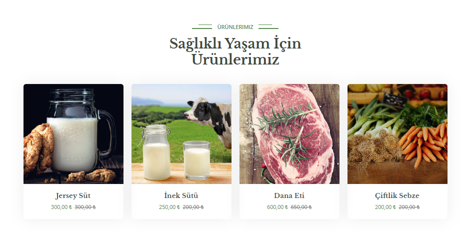
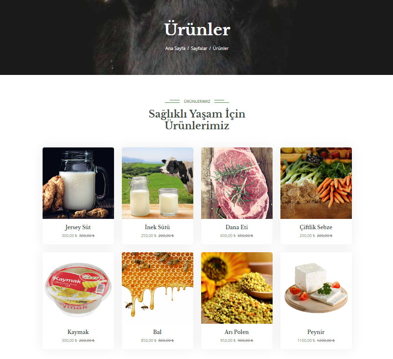
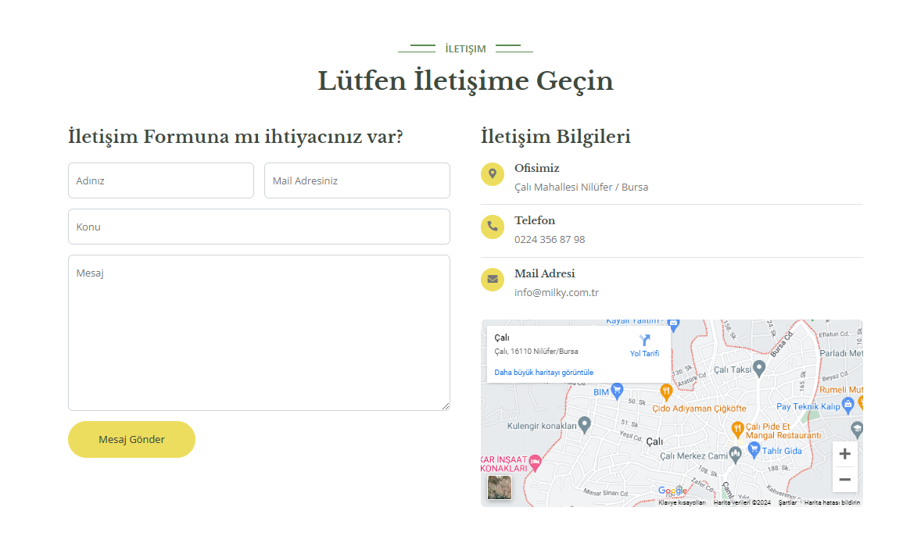

# Süt Ürünleri Yönetim Sistemi

Bu proje, süt ürünleri yönetim sistemi için bir API uygulamasıdır. Projede Entity Framework Core kullanılarak Code First yaklaşımıyla MSSQL veritabanı kullanılmıştır. Ayrıca, kullanıcı kimlik doğrulama işlemleri için ASP.NET Core Identity entegrasyonu yapılmıştır.

## Proje Amaçları

- Süt ürünleri için CRUD (Create, Read, Update, Delete) operasyonlarını yönetmek.
- Kullanıcıların kayıt olması, giriş yapması ve yetkilendirme işlemlerini gerçekleştirmek.
- Sistem yöneticilerinin ürünleri kategori ve alt kategori yapısında yönetmesini sağlamak.
- API üzerinden ürünlerin listelenmesi, ekleme, güncelleme ve silme işlemlerini sağlamak.

## Kullanılan Teknolojiler ve Kütüphaneler

- **ASP.NET Core 3.1**: API uygulaması geliştirmek için kullanılmıştır.
- **Entity Framework Core**: MSSQL veritabanı ile ilişkilendirilmiş Code First yaklaşımı kullanılarak veri modellemesi yapılmıştır.
- **ASP.NET Core Identity**: Kullanıcı kimlik doğrulama, yetkilendirme ve rol yönetimi için entegre edilmiştir.
- **Swagger**: API dokümantasyonu için Swagger kullanılmıştır.
- **Newtonsoft.Json**: JSON serileştirme/deserileştirme işlemleri için kullanılmıştır.
- **FluentValidation**: DTO nesneleri için doğrulama kuralları tanımlamak için kullanılmıştır.

## Resimler

 
 
 
 
 
 
 
 
